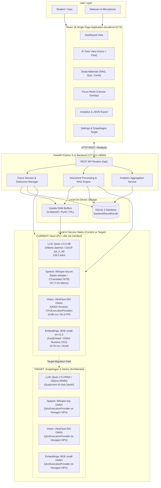

# FocusFlow AI: Final System Architecture

> **Qualcomm Snapdragon AI Lab Build & Present Challenge**  
> *Architectural Specification & Data Flow Map*  
> **Current Verified Platform:** Host CPU / x86_64  
> **Target Deployment Platform:** Qualcomm Snapdragon X Series (Hexagon NPU)

---

## 1. End-to-End System Architecture



---

## 2. Document Ingestion & RAG Data Flow

```
+-----------------------------------------------------------------------------------+
|                            DOCUMENT RAG PIPELINE (ON-DEVICE)                      |
+-----------------------------------------------------------------------------------+

   [ Upload Course PDF ] (Drag & Drop in UI)
             │
             ▼
   [ PyMuPDF Parser (fitz) ]
      • In-memory byte parsing (zero disk temp files)
      • Clean text extraction with source page tagging
             │
             ▼
   [ TextChunker Service ]
      • 400-word sliding window passages
      • 50-word context overlap
      • Injects metadata: {document_id, chunk_index, page_number}
             │
             ▼
   [ FastEmbed ONNX Engine (bge-small-en-v1.5) ]
      • Generates 384-dimensional dense vectors
      • Current: ONNX Runtime CPUExecutionProvider (10.76 ms / chunk)
      • Target: QnnExecutionProvider on Hexagon NPU (<2.5 ms / chunk)
             │
             ▼
   [ SQLite Relational Storage (focusflow.db) ]
      • Table: documents (metadata, page_count, chunk_count)
      • Table: document_chunks (chunk_text, page_number, embedding_blob)
             │
   ══════════╪══════════════════════════════════════════════════════════════════════
             │ QUERY TIME (Student asks a question)
             ▼
   [ Query Vectorization ]
      • FastEmbed computes 384-d vector for user query
             │
             ▼
   [ Vector Similarity Search (NumPy) ]
      • In-memory dot product cosine similarity scoring
      • Ranks and extracts top-k chunks with page numbers
             │
             ▼
   [ Grounded Prompt Assembly ]
      • System Prompt: "Answer solely from the following textbook excerpts..."
      • Appends retrieved chunk texts and source page tags
             │
             ▼
   [ Local LLM (Qwen 2.5 0.5B via Ollama) ]
      • Generates streaming answer at 109.3 tok/s
      • Direct attribution: cites exact source page numbers
             │
             ▼
   [ Student UI ] Grounded answer rendered with clickable page citation badges.
```

---

## 3. Voice Transcription Data Flow

```
[ Browser Microphone ]
         │ (WebRTC MediaRecorder: Opus/AAC audio blob)
         ▼
[ POST /api/speech/transcribe ]
         │ (Streamed into volatile memory: io.BytesIO)
         ▼
[ In-Memory PyAV Demuxer ]
         │ (Decodes audio directly to 16 kHz float32 NumPy array)
         ▼
[ faster-whisper INT8 Engine (CTranslate2) ]
         │ (Transcribes speech in 107.2 ms, RTF: 0.054x)
         ▼
[ In-Memory Buffer Purged ]
         │ (Zero audio files or voiceprints saved to disk)
         ▼
[ Transcribed Text ] Transmitted back to student chat input box.
```

---

## 4. Vision Focus Mode & Temporal Debounce Data Flow

```
[ Laptop Webcam ]
         │ (HTML5 Canvas snapshot every 500 ms: 320x240 RGB JPEG)
         ▼
[ POST /api/focus/frame ]
         │ (Decoded in RAM into transient NumPy array)
         ▼
[ UltraFace-320 ONNX Model ]
         │ (ONNX Runtime CPU EP: 19.88 ms latency, 50.3 FPS)
         ▼
[ Raw Detection Output ]
         │ (Bounding box: [x1, y1, x2, y2], confidence score, face center)
         ▼
[ 3-Frame Temporal Debounce State Machine ]
         │
         ├── If 3 consecutive frames with face present -> State = "Present"
         ├── If face present but center offset > threshold -> State = "Head Turned"
         └── If 3 consecutive frames without face -> State = "Away"
         │
         ▼
[ Transient Frame Deleted ]
         │ (Zero video frames or facial embeddings written to disk)
         ▼
[ Real-Time Telemetry Streamed to UI ]
         • Presence State ("Present" / "Away")
         • Inference latency (ms) and FPS
         • Bounding box overlay rendered on live video canvas
```

---

## 5. Local Analytics & Persistence Data Flow

```
[ Focus Sessions / Study Interactions / Document Q&A ]
                         │
                         ▼
[ SQLite 3 Database (backend/focusflow.db) ]
    ├── Table: documents
    ├── Table: document_chunks
    ├── Table: focus_sessions
    └── Table: study_interactions
                         │
         ┌───────────────┴───────────────┐
         ▼                               ▼
[ Aggregation Queries ]         [ One-Click JSON Export ]
(GET /api/analytics/overview)   (GET /api/analytics/export/download)
 • Daily & weekly study hours    • Self-contained structured JSON
 • Verified focus score curves   • Complete student data portability
 • AI interaction counters       • Zero cloud lock-in
```

---

## 6. Hardware Architectural Comparison: Current vs Target

| System Layer | Current Development Host (Verified) | Target Snapdragon Platform (Architected) |
| :--- | :--- | :--- |
| **Compute Hardware** | Intel Core i5-1035G1 (x86_64, 4C/8T) | Qualcomm Snapdragon X Elite / X Plus |
| **Operating System** | Windows 11 Home (x86_64) | Windows 11 on ARM64 |
| **AI Processing Unit** | Host CPU (AVX2/FMA vector instructions) | Dedicated **45 TOPS Hexagon NPU** |
| **Vision Runtime** | ONNX Runtime (`CPUExecutionProvider`) | ONNX Runtime (`QnnExecutionProvider` on NPU) |
| **Speech Runtime** | `faster-whisper` / CTranslate2 (INT8 on CPU) | Whisper-tiny ONNX (`QnnExecutionProvider` on NPU) |
| **Embedding Runtime** | FastEmbed (`CPUExecutionProvider`) | FastEmbed ONNX (`QnnExecutionProvider` on NPU) |
| **LLM Runtime** | Ollama daemon (x86_64 GGUF Q4_K_M) | Ollama ARM64 / Qualcomm AI Hub GenAI |
| **Power Profile** | ~15W–25W continuous CPU package power | **Sub-watt NPU inference / all-day battery** |
| **Validation Status** | **VALIDATED (Host CPU)** | **TARGET IDENTIFIED (Pending Hardware)** |
